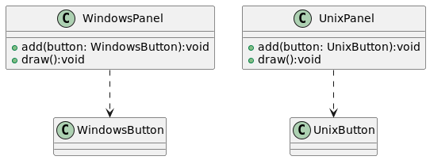
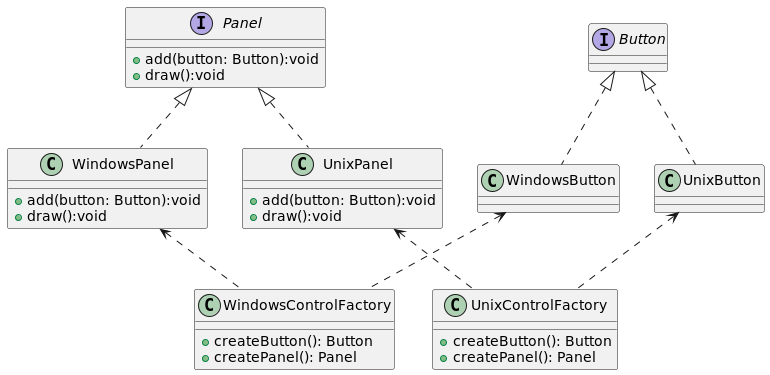
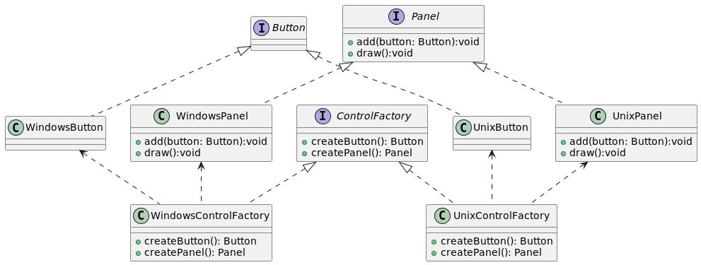

# Abstract Factory (Alias: Patron Factory)
1. Es un patron creacional, el Objetivo basicamente es encapsular la creacion de una familia de objetos en una clase esas clase tiene como sufijo el **Factory**. ej: WindowsControlFactory
2. Leer el absFac1.test estamos creando funcionalidad para un OS y estamos instanciando clases concretas WindowsButton, WindowsPanel UnixButton, UnixPanel,etc. Entonces tenemos: 

3. Para aplicar el patron Abstract Factory primero creamos abstracciones de button y panel y luego creamos
las fabricas de Windows y Unix:  

4. Recordando que si tenemos una firma en una abstraccion (Panel): 
**add(button: Button): void** 
las clases que implementan la abstraccion deben tener el mismo tipo en sus parametros. 

5. Sin embargo en **ts** se puede hacer **add(button: WindowsButton)** en clase hija WindowsPanel pero en **Java** no se puede (no cumple el contrato). Recomiendo mantener los mismos tipos en sus parametros.

6. Aun que tengamos las factory concretas que pasa si tenemos una clase Aplication que debe funcionar tanto para 
WindowsFactory como UnixFactory que se define por una variable de entorno (.env) ? -> Necesitamos una abstraccion para las factorys: 

7. Observando el diagrama: tenemos en un metodo en ControlFactory que retorna otra abstraccion: **createButton(): Button** las clases que implementan ControlFactory al implementar el contrato, en particular este metodo pueden retornar un tipo de dato mas especifico y tener la firma por ej: **public createButton() : WindowsButton**  permitido tanto en ts como en java. 

