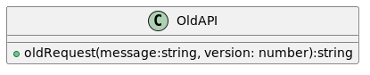
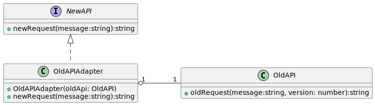

# Adapter
1. Es un patron de diseño estructural, tiene como objetivo convertir la interfaz de una clase (conjunto de metodos de una clase ej: OldApi) en otra interfaz que el cliente espera (necesita) (ej: NewApi). 
1. Esta logica se encapsula en la clase **Adapter (Adapatador)** , de esta manera permite a las clases trabajar juntas. 
1. La clase Adapter:
    1. Implementa la abstraccion que el cliente **usa/requiere/necesita** (para colaborar con las clases del cliente)
    1. Tiene una composicion con el objeto a ser adaptado **Adaptee**. 
    1. Recibe las llamadas del cliente y se encarga de traducirlas usando los metodos de **Adaptee** para que responda el mensaje.
1. for encript the message we need to install crpyto-js: 
    1. npm install crypto-js
    1. npm install --save @types/crypto-js
    1. then import **import * as crypto from "crypto-js";** in some ts. 
1. En el test1 usando OldAPI (Codigo q no podemos tocar) pasamos a mano el mensaje y la version ademas estamos enviando el request tal cual sin encriptar la informacion. que pasa si ahora el cliente tiene una nueva abstraccion para enviar request con una interfaz mas simple y encripta el mensaje?.

1. En el test2 creamos el adapter OldAPIAdapter que implementa la abstraccion que el cliente ahora usa  para enviar request (**NewAPI**)
    implementamos este comportamiento usando los metodos de OldAPI para que responda el mensaje. (ademas encriptamos la informacion).

1. **Heuristica: Adapter implementa la abstraccion que el cliente usa y componemos con la clase que necesita ser adaptada**

