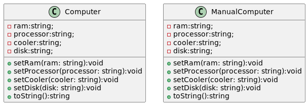
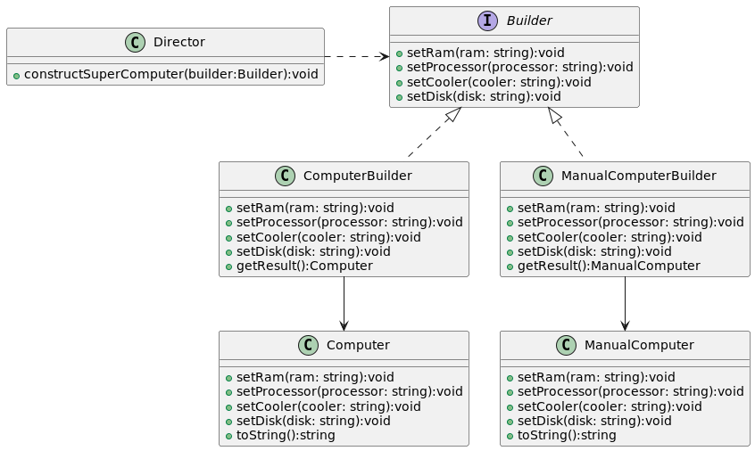

# Patron builder 
1. Es un patron creacional, basicamente se usa para poder construir objetos complejos, donde no conocemos el tamaño total del objeto. 
Asi que lo vamos construyendo de a pedazos. 

1. Inicialmente tenemos en el **test1** la construccion a mano de **Computer** y **ManualComputer**:  

1. En el **test2** refactorizamos creando entidades **ComputerBuilder** y  **ManualComputerBuilder** estas tienen un Computer y ManualComputer respectivamente. 
Estas entidades fueron creadas para delegarles la implementacion especifica de los pasos de la construccion. Ahora creamos la abstraccion **Builder** para fijar el contrato que cada 'Builder hija' tiene que implementar.

1. Luego se crea  la clase **Director**  que es la entidad que encapsula la configuracion del objeto, aca se puede construir muchas varaciones de un producto (Computer/ManualComputer) para hacerlo recibi una abstraccion (**Builder**).

