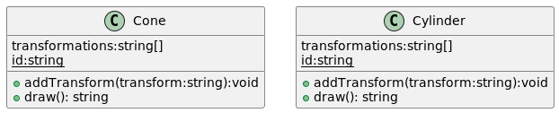
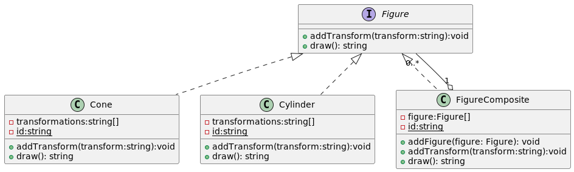

# Patron Composite
1. Es un patron de diseño estructural sirve para construir objetos complejos a partir de objetos mas simples y similares entre si, gracias a la 
composicion recursiva y a una estructura en forma de arbol (**Solo tiene sentido en modelos cuya estructura es un arbol**). Como los objetos creados  poseen una interfaz en comun se puede aplicar procedimientos al total o una de las partes de la estructura compuesta como si fuera un nodo.

1. En test1 observamos como se aplican transformaciones de forma aislada a un cone y a un Cylinder, peoro que sucede si ahor quiero agrupar un grupo
de cilindros y conos y quiero aplicarle una transformacion? y luego tengo otro conjunto de solo cones y luego quiero meter ambos conjuntos en un conjunto mas 
grande y aplicarle transforamaciones a todos los elementos como hago?. Con el diseño actual no se puede. 

1. Refactorizando en el test2 ahora creando una abstraccion Figure y las instancias concretas Cone, Cylinder implementan la abstraccion, ademas se crea 
la entidad CompositeFigure es un contendor que tendra un conjunto de figura (o otros contendores) (Delega la logica de draw, addtransform, etc). 
1. Tanto las hojas simples (Cone, Cylinder) como el contenedor (CompositeFigure) tienen la misma interfaz.
1. Ademas Como un contendor puede estar compuesto por otras hojas o contenedores nos permite construir una estructura de objetos recursivos anidados parecido a un arbol. 
1.  
1. Al crear la abstraccion ahora podemos agregar cualquier tipo de Figure dentro de CompositeFigure y aplicarle los mismos metodos.  

