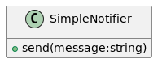
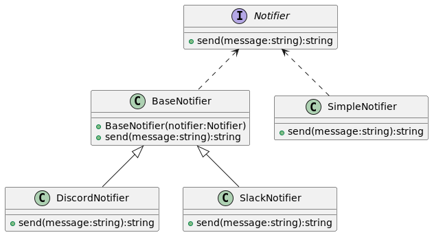

# Decorator 
1. Es una patron de diseño estructural basicamente consiste en añadir comportamientos a un objeto, para esto se coloca a ese objeto dentro de otros objetos
que contienen estas nuevas funcionalidad/comportamiento.
1. Tenemos una clase que "decora a otra" estas tienen el mismo contrato. (interaz), ademas la logica nueva la podemos agregar antes o despues de la logica que decoramos.

1. Veamos el test1 creamos un **SimpleNotifier** y le mandamos un string para que lo envie. Ahora que sucede si queremos enviar tambien por Discord? y que pasa 
si quiero enviarlo tambien por Discord y Slack? o  por unicamente Slack?.

1. Ahora hacemos el refactor en test2 creamos la abstraccion Notifier y tanto la nueva Entidad BaseNotifier como SimpleNotifier implementan esta abstraccion. 
1. Notifier: Es la abstraccion que usamos para poder encapsular la cadena de operacion que haremos. 
1. BaseNotifier es la entidad que usamos para poder aplicar el send a un objeto Notifier antes (o despues) de aplicar nuestro send. 
1. Los "decoradores" DiscordNotifier o SlackNotifier heredan de BaseNotifier, y en su send invocan al send de BaseNotifier.

