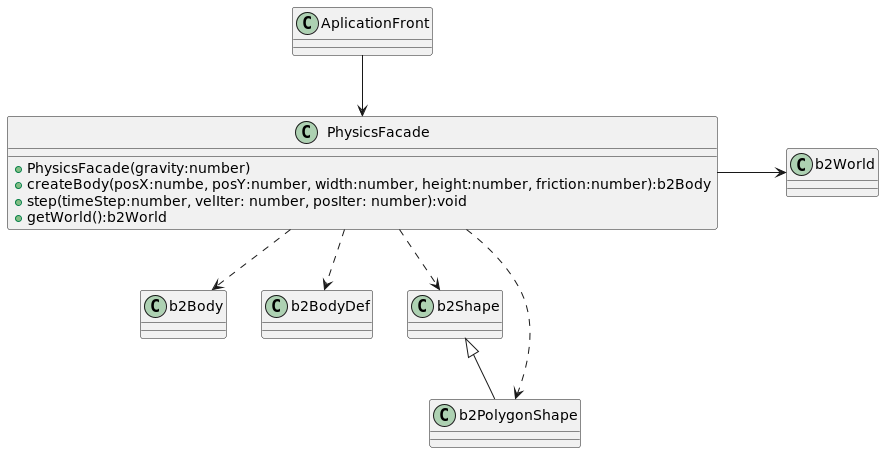

# Facade 
1. Es un patron de diseño estructural que proporciona una interfaz simple a una biblioteca/framework o un grupo de clases complejas. 
De esta manera desacoplamos los detalles de implementacion de las clases de terceros con la logica de nuestras clases. 
1. Ahora vamos a probar usando la biblioteca box2D (esta es una library para simular fisica 2D ) para ts 🤯 so we need to install: 
    1. npm install box2dweb
    1. npm install --save @types/box2d

Vemos en el diagrama: 

1. Usando PhysicalFacade creamos una interfaz sencilla para poder usar la API de la biblioteca de manera mas sencilla usando lo justo que necesitamos.
1. Observar como AplicationFront conoce a PhysicalFacade y no a ninguna clase b2Body, b2World, etc. Si el dia de mañana hay algun cambio en Box2D solo tocariamos
el PhysicalFacade.  

