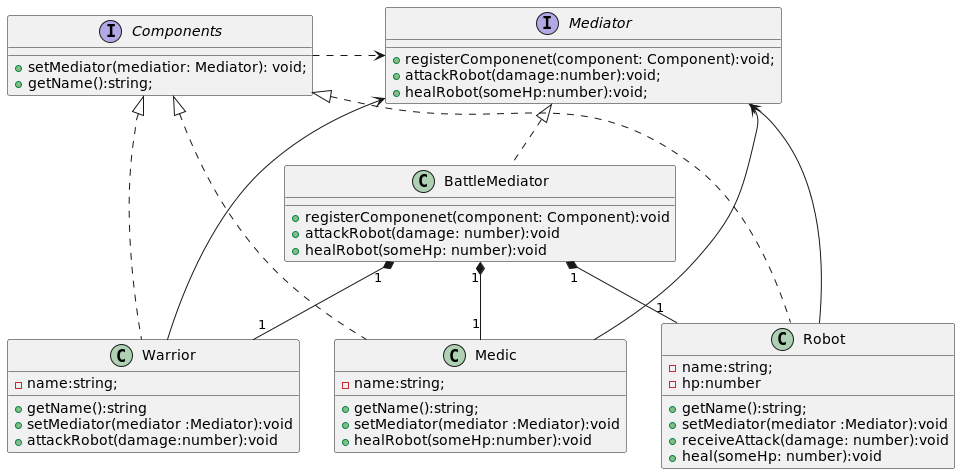

# Patron Mediator 
1. Es un patron de diseño estructural, basicamente tiene el objetivo de reducir la comunicacion directa y caotica entre muchas clases entre si (Alto acoplamiento),
para lograrlo se crea la abstracion Mediator, esta tiene una relacion bidirecional con cada clase, por lo tanto el resto de clase solo depende de esta abstraccion.
1. Ademas como dependemos de una abstraccion (**Mediator**) podemos tener distintos tipos de mediatores concretos. 
1. Las clases **colaboran indirectamente** a traves del Mediator.

1. Para el ejemplo tenemos 3 clases que implementa la abstraccion **Component** y tienen una referencia al mediator, donde a este delegaran gran parte de su
comportamiento, de esta manera solo conocen al Mediator, ver  como no tienen ningun atributo q pertence a otra clase. 
1. **BattleMediator** es una clase concreta que implementa la abstraccion **Mediator** de esta manera podemos tener distintos tipos de Mediator. 

1. Observar que una interfaz no puede tener estado la flecha es de dependencia y no de asociacion. 
1. BattleMediator tiene una referencia a un warrior, robot y medic, idem estos 3 tienen una referencia a un **Mediator** (**BattleMediator**).  
1. para pensar como hacemos con colecciones en un mediator?  
1. Con un double dispath para eliminar los if en el metodo registerComponenet agregando sets, y esos tambien tendria q tenerlo la abstraccion. 
