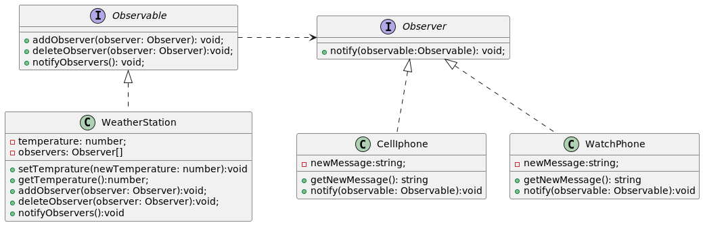

# Patron Observer 
1. Es un patron de diseño de comportamiento basicamente define que ante el cambio de estado de un objeto lanzara una notificacion a todos los 
objetos que estan suscriptos (observadores/dependientes) a los cambios de este objeto.
1. Para lograrlo en la implementacion de observer del ejemplo tenemos las sgts entidades: 
1. **Observable**: Es la abstraccion que nuestras clases concretas debe implementar para que sean observada, pueda add/deletes observers y notificarlos cuando 
 cambie su estado. 
1. **Observer**: Es la abstraccion que deben implementar las clases que quieran observar (estar pendiente) a los cambios de estado de una clase Observable.

En el ejemplo tenemos: 
1. La abstraccion Observable con los metodos para add/delete de un observer y un notify, y tenemos una clase q implementa la abstraccion (WeatherStation) esta y al momento de notificar (por un seter de cambio de temperature) le pasamos una referenca de si misma a cada Observer.  lo que provoca que nuestro Observer tenga el metodo **notify(observable: Observable): void**.

1. Tenemos 2 clases concretas q implementa la abstraccion Observer CellIphone y WhatchPhone. si, estoy usando un **instaceof y el as** es una manera de resolverlo pero hay 2 mas: 
    1. Podria elimianr el if y instanceof/as usando double dispatch pero me quedaria metodos como **accept(aObserver:Observer)** en Observable y un metodo del tipo en Observer:  **visitWeatherStation(weatherStation: WeatherStation): void**, es otra solucion pero que mancha las interfaces.
    
    1. Otra forma de solucionar podria ser creando una clase abstracta WeatherObserver q hereda de la interfaz Observable y ahora por ej CellPhone tendria que heredar de WeatherObserver en CellPhone implementamos el metodo de Observer y en Observable (tendria el metodo accept pero con WeatherObserver) y le mandamos mensaje a este el con **visitWeatherStation(weatherStation: WeatherStation):**. Pero y si CellPhone/WhatchPhone ya esta heredando? nose podria. 

1. **Los deletes**: hay algo interesante en **public deleteObserver(observer: Observer): void** es que con (!==) comparamos referencias asi que si le pasamos 
    el mismo objeto q agregamos antes lo elimianra sin problemas. lo mismo ocurre en java con un this.observers.remove(observer); lo eliminamos (dejando la implementacion por deafault de equals que compara referencias, si la sobrescribimos por ej en java cambiaria).
1. 

