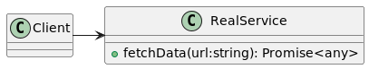
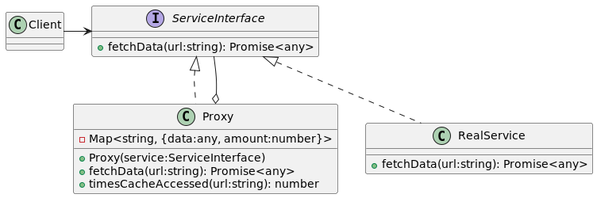

# Proxy
1. Es un patron de diseño estructural, tiene como objetivo proporcionar un intermediario (Proxy) de un objeto (object service) para controlar su acceso.
1. En la implementacion se crea la clase Proxy con la misma interfaz que un objeto service, entonces al recibir la solicitud de un cliente con la clase Proxy esta  nos permite agregar comportamiento antes o despues de delegarle el trabajo al object service. 

1. Luego actualizamos nuestra aplicacion para pasar el objeto Proxy a todos los clientes en lugar objeto original (objeto service).
1. Debemos crear una abstraccion **ServiceInterface** by example, para poder usar el Proxy o objeto service de forma indestinguible. (hacemos intercambiables el Proxy con el objeto service.).

1.  En el test1 hacemos varios GET a una misma pagina, como podemos ahorrarnos ancho de banda? o catchear de algna manera la respuesta? o aplicar logica antes 
o despues del fetch como ver permisos,etc ? 
usando solo **RealService** no es suficiente. Necesitamos una entidad para encapsular este comportamiento extra y queremos abstraer ese comportamiento de la clase 
que usa el service (asi no violamos single responsability). El cliente (clase generica que usa el service) usa directamente el RealService: 

1. En el test 2 hacemos el refactor creamos la abstraccion ServiceInterface y la entidad Proxy que junto a RealService implementaran el mismo contrato que la abstraccion (los hacemos intercambiables). Ademas la clase proxy podra usar cualquier service q implementa la misma abstraccion.  
1. Al crear el proxy definimos que service usara, podria ser un RealService o otro Service en un futuro (no habrai problema porque dependemos de una abstraccion y no una clase concreta ✅ open/closed).
1. Vemos que al hacer sucesivos "fetch" a una misma url la primera vez hace el fetch y lo guarda en cache, asi que las request sgts seran resueltas por el cache, 
la clase Proxy nos permitio configurar esta comportamiento. 
1. El cliente usa directamente la abstraccion (codea contra abstracciones y no contra implementaciones).

1. En particular este proxy que guarda cache se considera un **Proxy virtual**. cachea informacion del object service para diferir el acceso a este.

