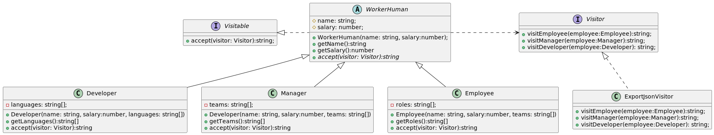

# Patron Visitor 
1. Es un patron de diseño de comportamiento basicamente consiste en delegar un nuevo comportamiento a implementar sobre un conjunto de clases a una abstraccion **Visitor**, esta abstraccion tendra un "visit" para cada objeto de ese  conjunto de clases. Como dependemos de una abstraccion entonces podremos tener distintos tipos de **Visitantes (Visitors)** para implementar distintos comportamientos nuevos al cojunto de clases. 
1. Es una forma de separar **el algoritmo** de la estructura del objeto. 
1. En el ejemplo: Simulamos un aplicacion Legacy con 3 clases Developer, Manager y Visitor heredan de **WorkerHuman**, ahora queremos agregar un nuevo comportamiento  exportar a json la informacion de cada WorkerHuman lo hacemos con un visitor para evitar violar single responsability en las clases hijas de Worker y como es codigo  legacy debemos hacerles las minimas modificaciones para no romper nada, asi que solo creamos la abstraccion **Visitable** y hacemos q WorkerHuman implemente la abstraccion y delegue la definicion del metodo **accept(visitor:Visitor):string** a cada clase hija respectiva.
1. Luego cada clase hija de WorkerHuman, eligira su **visit** respectivamente (ej: Manager usara **visit.visitManager(this)**, etc) usar en el visitor que recibe de parametro.
1. Se crea la abstraccion **Visitor** esto para permitir en un futuro crear otros grupos de algoritmos para las clases hijas de **WorkerHuman**.
1. En general esto patron se aplica a codigo legacy q nos restringuen tocarlo mucho (posiblemente codigo legacy)

